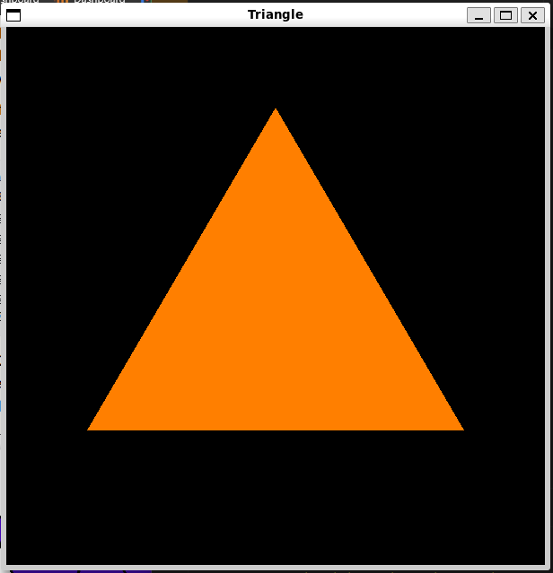

# A guide to using OpenGL

## Setup

### Requirements

1. **C Compiler**
    1. **Windows**: MingGW
    2. **Linux**: GCC
    3. **macOS**: Clang
2. **OpenGL Libraries**
3. **Window Management Library**
    1. **GLFW**
    2. **GLUT**
4. **Development Environment**
    1. **IDE**
    2. **Text editor**

### Installation

1. **C Compiler**
    1. **Windows**
        1. **MinGW**: https://github.com/skeeto/w64devkit/releases
    2. **Linux**
        1. **GCC**:
            * Usually comes preinstalled. You can check this by typing:
              ```shell
              gcc --version
              ```
            * If the output is version information, then you're good to go.
            * If you get an error or a message that says this package is not installed, you can install gcc by typing:
              ```shell
              sudo apt-get install gcc 
              ```      
    3. **macOS**
        * Comes preinstalled.
2. **OpenGL Libraries**
    1. **Linux**
        * Install using the following command:
            ```shell
            sudo apt-get install libgl1-mesa-dev libglu1-mesa-dev freeglut3-dev
            ```
    2. **Windows**
        * **OpenGL**: Comes with graphics drivers.
        * **GLUT**: https://freeglut.sourceforge.net/index.php#download
        * **GLFW**: https://www.glfw.org/download.html
    3. **macOS**
        * **OpenGL**: Pre-installed.
        * **GLFW**: Install using brew:
            ```shell
            brew install glfw
            ```
3. **Development Enviromnet**
    1. **VSCode**: https://code.visualstudio.com/Download
    2. **Xcode**: https://developer.apple.com/xcode/
    3. **CLion**: https://www.jetbrains.com/clion/download/

### Compiling Code

1. **Linux**

    * Type the following in the terminal in the directory where your code is:

         ```shell
         gcc -o opengl_example opengl_example.c -lGL -lglut -lGLU -lm
 
         ./opengl_example
         ```
2. **Windows**
    * Type the following in the terminal in the directory where your code is:
        ```shell
        gcc -o opengl_example.exe opengl_example.c -lglfw3 -lopengl32 -lglew32 -lgdi32

        opengl_example.exe
        ```

3. **macOS**
    * Type the following in the terminal in the directory where your code is:
        ```shell
        gcc -o opengl_example opengl_example.c -framework GLUT -framework OpenGL -framework Cocoa
 
        ./opengl_example
        ```

## Demo

Let's begin with a little demo of OpenGL. We are going to display a black window with white borders.

1. Create a C file and call it `hello_OpenGL.c`.
2. Open the file in your development environment.
3. Import the OpenGL library.
    * If you're on Windows or Linux:
        ```C++
        #include <GL/glut.h>
        ```
    * If you're on macOS
        ```C++
        #include <GLUT/glut.h>
        ```
4. Add the following code to your file:
    ```C++
    int main(int argc, char **argv) {
    glutInit(&argc, argv);
    glutInitDisplayMode(GLUT_SINGLE);
    glutInitWindowSize(600, 600);
    glutInitWindowPosition(0, 0);
    glutCreateWindow("Hello world!");
    glutMainLoop();

    return 0;
    }
    ```
5. Run your code with the following command in the terminal:
    ```shell
    gcc -o hello_OpenGL hello_OpenGL.c -lglut
    ```
6. You should see a black window with white borders in the top left corner of your screen.

## Initialization

### glutInit(&argc, argv)

* Initializes GLUT library.
* Takes arguments from command line.
* Processes any arguments that control GLUT's behaviour.

### glutInitDisplayMode(GLUT_DOUBLE | GLUT_RGB | GLUT_DEPTH)

* Sets initial display mode for the window.
    * `GLUT_DOUBLE`:
        * Enables double buffering:
            * Rendering is done on a back buffer, and then it is swapped with the front buffer to display.
        * Prevents flickering during rendering.
    * `GLUT_RGB`:
        * Specifies that the window will use an RGB color model.
    * `GLUT_DEPTH`:
        * Enables depth buffering:
            * Handles depth calculations.
            * Ensure that objects are rendered in the correct order (near objects obscure far objects).

### glutInitWindowSize(width, height)

* Sets the initial size of the window to `width` pixels wide and `height` pixels tall.

### glutCreateWindow(window_title)

* Creates a window with the title `window_title`.
* Returns an integer identifier for the window.

### glClearColor(R, G, B, A)

* Sets the clear color for the window, which is the color used when the color buffers are cleared.
* The values `R`, `G`, `B`, `A` correspond to (RGBA) values.

### glutDisplayFunc(display)

* Registers the display callback function, `display`, which will be called whenever the window needs to be redrawn.
* `display` function contains the code for rendering the scene.

### glutReshapeFunc(reshape)

* Registers the reshape callback function, `reshape`, which is called whenever the window is resized.
* `reshape` function typically adjusts the viewport and projection matrix to ensure the scene is rendered correctly in
  the new window size.

### glutIdleFunc(idle)

* Registers the idle callback function, `idle`, which is called whenever the application is idle (not handling other
  events).
* `idle` function can be used to update animations or perform background tasks.

### glutMainLoop()

* Enters the GLUT event processing loop.
* Listens for events such as keyboard input, mouse movement, and window resizing, and dispatches them to the appropriate
  callback functions.
* Program will remain in this loop until the window is closed or the program is terminated.

## State

The state includes all settings that affect the rendering.

## Pen

The pen is responsible for drawing shapes. The pen is initialized as follows:

```C++
glBegin(primitive);
...
glEnd();
```

## Refresh buffer

Once something has been rendered, you need to refresh the buffer in some way.

* In single buffer display mode, `GLUT_SINGLE`, use the following command after drawing:
    ```C++
    glFlush();
    ```
* In double buffer mode, `GLUT_DOUBLE`, use the following command:
    ```C++
    glutSwapBuffers();
    ```

## Shapes and Colours in OpenGL

### Primitives

* Basic geometric shapes.
    * **Vertex**: simply a point in 3D, given by its x, y, and z coordinates.
        * **Points**: Single vertices.
        * **Lines**: Connecting two vertices. Also called edges.
        * **Triangles**: A polygon with three vertices.
        * **Obselete**: Primitives which are no longer supported.
* Used as the building blocks for creating complex 3D scenes.

#### Drawing vertices

* Vertices are drawn with the following functions:

    ```C++
    glVertex2f(x, y);   //for 2D
    glVertex3f(x,y,z);  //for 3D
    ```

* The size of point primitives can be changed by calling:
    ```C++
    glPointSize(size);  //size specifies diameter of point, in pixels
    ```
* By default, points are squares. You can get circular points by calling:
    ```C++
    glEnable(GL_POINT_SMOOTH);
    ```

#### Drawing line segments

* `GL_LINES`:
    * Draws disconnected line segments.
    * Specify two vertices for each segment that you want to draw.
* `GL_LINE_STRIP`:
    * Draws connected sequences of line segments.
* `GL_LINE_LOOP`:
    * Adds an extra line segment from the final vertex back to the first vertex.


* The width for line primitives can be set by calling:
    ```C++
    glLineWidth(width)
    ```
    * The line width is always specified in pixels.
    * It is not subject to scaling by transformations.

#### Drawing triangle segments

* There are three primitives for drawing triangles segments:
    * `GL_TRIANGLES`:
        * Primitive, with nine vertices.
        * With that primitive, every set of three vertices makes a separate triangle.
    * `GL_TRIANGLE_STRIP`:
        * The first three vertices produce a triangle.
        * After that, every new vertex adds another triangle to the strip, connecting the new vertex to the two previous
          vertices.
    * `GL_TRIANGLE_FAN`:
        * the first three vertices make a triangle, and every vertex after that adds anther triangle, but in this case,
          the new triangle is made by connecting the new vertex to the previous vertex and to the very first vertex that
          was specified (vertex “A” in the picture).


### Triangle demo

Lets draw a triangle on our hello_OpenGL demo.

1. Create a function called `triangle()`:

```c++
void triangle() {
    glClear(GL_COLOR_BUFFER_BIT);   //fill the drawng area with a colour that you set
    glBegin(GL_TRIANGLES);  //begin drawing and what primitive to draw
    glColor3ub(255, 255/2, 0);     //what colour the primitive should be drawn in
    glVertex2f(-0.7, -0.5);     //where the first vertex is
    glVertex2f(0.7, -0.5);
    glVertex2f(0, 0.7);
    glEnd();    //close the drawing area
    glutSwapBuffers();  //swap buffers so what is drawn can be displayed
}
```

2. initialize your glut window in `main()`:

```c++
int main(int argc, char **argv) {
    glutInit(&argc, argv);
    glutInitDisplayMode(GLUT_DOUBLE | GLUT_DEPTH | GLUT_RGB);
    glutInitWindowSize(600, 600);
    glutInitWindowPosition(100, 100);
    glutCreateWindow("Triangle");
    glutDisplayFunc(triangle);
    glutMainLoop();

    return 0;
}
```

3. Compile and run the program:
```shell
gcc -o triangle triangle.c -lGL -lglut -lGLU -lm
```

You should now see an orange triangle with a black background:


##### Triangle strip program

Let's make another program and call it `triangle_strip.c`.

We'll repeat the same procedure as above but now, we'll change the argument for the argument passed to `glBegin` from `GL_TRIANGLES` to `GL_TRIANGLE_STRIP`.  Then, we'll change the vertices to the following:


```c  
    glVertex2f(-0.8f, 0.5f); // Vertex 1  
    glVertex2f(-0.6f, -0.5f); // Vertex 2  
    glVertex2f(-0.4f, 0.5f); // Vertex 3  
    glVertex2f(-0.2f, -0.5f); // Vertex 4  
    glVertex2f(0.0f, 0.5f); // Vertex 5
```

You should get something that looks like a trapezoid. If you would like to outline it, simply copy the vertices and past them in a new `glBegin` with the arguments `GL_LINE_LOOP`.

Now, by removing vertices, we can get a variety of different shapes. I removed vertex 4 and 5, then put vertex 4 back. This resulted in the following:


If you're wondering how i moved things around, then worry not. We will go over it in the transformation section.

#### Drawing circles

OpenGL does not explicitly have a way to draw circles. Instead, we can do this using parametrization:

```C
void circle(radius, angle, slices) {
	glBegin( GL_LINE_LOOP );
	for (i = 0; i < slices; i++) {
	    angle = 6.2832 * i / 64;  // 6.2832 represents 2*PI
	    x = radius * cos(angle);
	    y = radius * sin(angle);
	    glVertex2f( x, y );
	}
	glEnd();
}
```

### Colour

Colour in OpenGL is typically specified using RGBA (Red, Green, Blue, Alpha) values. Alpha represents the transparency of the colour.

Colour functions have the following structure:

```c
glColor#*()
```

where `#` represents how many arguments we're passing and `*` represents what data type we're passing.

* `#`
	* `3`: RGB
	* `4`: RGBA
* `*`
	* can take
		* `f`: float
			* `f` ranges between 0 and 1.
		* `d`: double
			* `d` ranges between 0 and 1.
		* `ub`: unsigned byte
			* `ub` allows you to use a range from 0 to 255.

### Using Arrays

It might be inefficient to manually write out your vertices when drawing, especially with large scale graphics. The solution to this is to use an array:

```c
float coords[] = { -0.5, -0.5,  0.5, -0.5,  0.5, 0.5,  -0.5, 0.5 };

glBegin(GL_TRIANGLE_FAN);
glVertex2fv(coords);      // Uses coords[0] and coords[1].
glVertex2fv(coords + 2);  // Uses coords[2] and coords[3].
glVertex2fv(coords + 4);  // Uses coords[4] and coords[5].
glVertex2fv(coords + 6);  // Uses coords[6] and coords[7].
glEnd();
```

Notice that we are using pointer arithmetic to navigate the array.

### Using Pointers

A more elegant solution is to use pointers:

```C
GLfloat vertices[] = {
    0.0f, 1.0f, 0.0f,
    -1.0f, -1.0f, 0.0f,
    1.0f, -1.0f, 0.0f
};
glEnableClientState(GL_VERTEX_ARRAY);
glVertexPointer(3, GL_FLOAT, 0, vertices);
glDrawArrays(GL_TRIANGLES, 0, 3);
glDisableClientState(GL_VERTEX_ARRAY);
```

where:

```C
void **glVertexPointer**(GLint size, GLenum type, GLsizei stride, const void* pointer);
```

* `size`
	* Specifies the number of coordinates per vertex. Must be 2, 3, or 4. The initial value is 4.

* `type`
	* Specifies the data type of each coordinate in the array. 
	* Symbolic constants `GL_SHORT`, `GL_INT`, `GL_FLOAT`, or `GL_DOUBLE` are accepted.
	* The initial value is `GL_FLOAT`.

* `stride`
	* Specifies the byte offset between consecutive vertices. 
	* If _`stride`_ is 0, the vertices are understood to be tightly packed in the array. 
	* The initial value is 0.

* `pointer`
	* Specifies a pointer to the first coordinate of the first vertex in the array. 
	* The initial value is 0.

### Clearing the scene

Clearing the screen before drawing a new frame is crucial to remove artifacts from the previous frame. A common operation is to clear the drawing area by filling it with some background color.

1. Set the colour:

```C
glClearColor(r,g,b,a);
```

2. Clear the buffer:

```C
glClear(GL_COLOR_BUFFER_BIT | GL_DEPTH_BUFFER_BIT);
```

## Transformation Pipeline

### Clip coordinates

#### Projection

To simulate projection perspective, we use the following code:

1. Enable `GL_PROJECTION`:
```C
glMatrixMode(GL_PROJECTION);
```

2. Load identity matrix:

```C
glLoadIdentity();
```

3. Create `frustrum`, truncated pyramid from camera to world:

```C
glFrustum( xmin, xmax, ymin, ymax, near, far );
```

4. Restore `GL_MODELVIEW`:

```C
glMatrixMode(GL_MODELVIEW);
```

#### Orthographic

To simulate orthographic perspective, we change a few things from above:

3. Create `rectangular solid`, from camera to world:

```C
glOrtho( xmin, xmax, ymin, ymax, near, far );
```

## Meshes

A mesh is simply a combination of faces that when put together in some complex geometry, represent some complex object.

### Index Faced Sets

We can represent all the vertices and faces of a mesh in an array.

#### Vertex array

The vertex array contains all the vertexes of the mesh.

#### Face array

The face array contains entries that represent the indexes of vertexes that make one face.

Let us look at an example:

##### Cube Demo

Let us start by drawing the cube on paper and thinking about where our coordinates will be. Do not fret over the specificity of the coordinates as we can just transform the resulting cube. Use a range between 0 and 1 for each coordinate value.

You should have a cube with 8 vertexes. Here are my coordinates:

```C
float vertex_array[][3] = {  
    {0.5, 0.5, 0}, // vertex 0  
    {0.5, 1.0, 0}, // vertex 1  
    {1.0, 1.0, 0}, // vertex 2  
    {1.0, 0.5, 0}, // vertex 3  
    {0.5, 1, 0.5}, // 4  
    {0.5, 0.5, 0.5}, // 5  
    {1, 1, 0.5}, // 6  
    {1, 0.5, 0.5} // 7  
};

int vertex_count = 8;    //we will use this later
```

Now, let's think about the faces of the cube. The face values you plot will change depending on how you want to render the cube. Let us begin by using lines to render the cube. Here are my faces:

```C
int outlined_face_count = 6;  
  
int outlined_face_array[][4] = {  
    {0, 1, 2, 3}, // 0  
    {0, 5, 4, 1}, // 1  
    {0, 5, 7, 3}, // 2  
    {6, 2, 3, 7}, // 3  
    {6, 4, 5, 7}, // 4  
    {6, 2, 1, 4} // 5  
};
```

Once we've initialised our cube, let us draw it:

```C
void outlined_cube() {  
    int v;  //represents vertex on a face
    float *vCoords;  //represents the vertex coords that correspond to v
    glColor3ub(255, 255, 255);  //make the outline white
    for (int face = 0; face < outlined_face_count; face++) {  
        glBegin(GL_LINE_LOOP);  
            for (int vertex = 0; vertex < 4; vertex++) {  
                v = outlined_face_array[face][vertex];  
                vCoords = vertex_array[v];  
                glVertex3fv(vCoords);  
        glEnd();  
    }}
```


##### Stellated Dodecahedron Demo

```C
double dodecVertices[][3] = {

    {-0.650000, 0.000000, -0.248278},

    {0.401722, 0.401722, 0.401722}, // This array contains the coordinates

    {0.650000, 0.000000, 0.248278}, // for the vertices of the polyhedron

    {0.401722, -0.401722, 0.401722}, // known as a stellated dodecahedron

    {0.000000, -0.248278, 0.650000},

    {0.000000, 0.248278, 0.650000}, // Each row of the 2D array contains

    {0.650000, 0.000000, -0.248278}, // the xyz-coordinates for one of

    {0.401722, 0.401722, -0.401722}, // the vertices.

    {0.248278, 0.650000, 0.000000},

    {-0.248278, 0.650000, 0.000000},

    {-0.401722, 0.401722, -0.401722},

    {0.000000, 0.248278, -0.650000},

    {0.401722, -0.401722, -0.401722},

    {0.248278, -0.650000, 0.000000},

    {-0.248278, -0.650000, 0.000000},

    {-0.650000, 0.000000, 0.248278},

    {-0.401722, 0.401722, 0.401722},

    {-0.401722, -0.401722, -0.401722},

    {0.000000, -0.248278, -0.650000},

    {-0.401722, -0.401722, 0.401722},

    {0.000000, 1.051722, 0.650000},

    {-0.000000, 1.051722, -0.650000},

    {1.051722, 0.650000, -0.000000},

    {1.051722, -0.650000, -0.000000},

    {-0.000000, -1.051722, -0.650000},

    {-0.000000, -1.051722, 0.650000},

    {0.650000, 0.000000, 1.051722},

    {-0.650000, 0.000000, 1.051722},

    {0.650000, -0.000000, -1.051722},

    {-0.650000, 0.000000, -1.051722},

    {-1.051722, 0.650000, -0.000000},

    {-1.051722, -0.650000, 0.000000}

};

  

int dodecTriangles[][3] = {

    {16, 9, 20},

    {9, 8, 20},

    {8, 1, 20}, // This array specifies the faces of

    {1, 5, 20}, // the stellated dodecahedron.

    {5, 16, 20},

    {9, 10, 21}, // Each row in the 2D array is a list

    {10, 11, 21}, // of three integers.  The integers

    {11, 7, 21}, // are indices into the vertex array,

    {7, 8, 21}, // dodecVertices.  The vertices at

    {8, 9, 21}, // at those indices are the vertices

    {8, 7, 22}, // of one of the triangular faces of

    {7, 6, 22}, // the polyhedron.

    {6, 2, 22},

    {2, 1, 22}, // For example, the first row, {16,9,20},

    {1, 8, 22}, // means that vertices number 16, 9, and

    {6, 12, 23}, // 20 are the vertices of a face.

    {12, 13, 23},

    {13, 3, 23}, // There are 60 faces.

    {3, 2, 23},

    {2, 6, 23},

    {18, 17, 24},

    {17, 14, 24},

    {14, 13, 24},

    {13, 12, 24},

    {12, 18, 24},

    {14, 19, 25},

    {19, 4, 25},

    {4, 3, 25},

    {3, 13, 25},

    {13, 14, 25},

    {4, 5, 26},

    {5, 1, 26},

    {1, 2, 26},

    {2, 3, 26},

    {3, 4, 26},

    {15, 16, 27},

    {16, 5, 27},

    {5, 4, 27},

    {4, 19, 27},

    {19, 15, 27},

    {7, 11, 28},

    {11, 18, 28},

    {18, 12, 28},

    {12, 6, 28},

    {6, 7, 28},

    {10, 0, 29},

    {0, 17, 29},

    {17, 18, 29},

    {18, 11, 29},

    {11, 10, 29},

    {0, 10, 30},

    {10, 9, 30},

    {9, 16, 30},

    {16, 15, 30},

    {15, 0, 30},

    {17, 0, 31},

    {0, 15, 31},

    {15, 19, 31},

    {19, 14, 31},

    {14, 17, 31}

void stellatedDodecahedron() {

    int v;

    double *vCoords;

    glPushMatrix();

        glScaled(4, 4, 4);

        glColor3f(1, 1, 1);

        for (int i = 0; i < 60; i++) {

            glBegin(GL_LINE_LOOP);

            for (int j = 0; j < 3; j++) {

                v = dodecTriangles[i][j];    // get the vertexes of a face

                vCoords = dodecVertices[v];    // get the coords of that vertex

                glVertex3dv(vCoords);    //draw that vertex

            }

            glEnd();

        }

    glPopMatrix();

}

};
```


# References

1. [Computer Graphics and Visualisation (wits.ac.za)](https://courses.ms.wits.ac.za/~branden/CGV/_book/index.html)
2. 